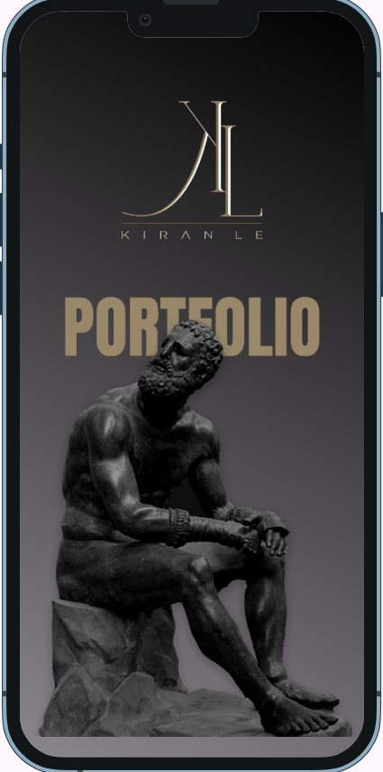
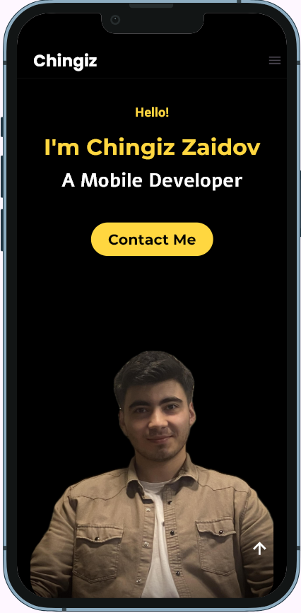
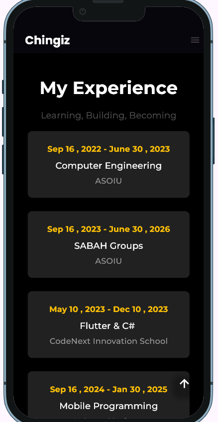
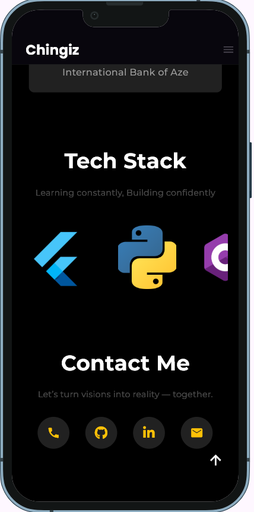
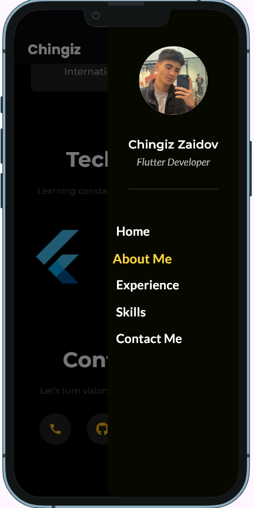

# 📱 Chingiz Zaidov's Portfolio App

Welcome to my Flutter-based personal portfolio app!  
It represents not only my skills but also my passion for elegant and interactive mobile designs.

---

## 🎯 Purpose

This app is built to showcase:
- My **developer identity**
- My **technical stack**
- Easy **contact options** for collaborations

---

## 🔥 UI Preview

### 🔓 Onboarding & Branding



### 🙋‍♂️ About Me & Contack Section



### 🛠️ Drawer Section


> All UI is responsive and crafted with attention to minimalism & modern design.

---

## 🧪 Technologies Used

- ⚙️ Flutter (UI toolkit)
- 💙 Dart (Programming Language)
- 🧱 Clean architecture principles
- 🖥️ VS Code for development

---

## 🚀 Getting Started

To run the project locally:

```bash
git clone https://github.com/your-username/flutter_portfolio.git
cd flutter_portfolio
flutter pub get
flutter run
